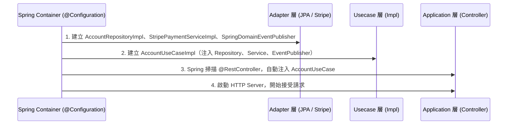

# 專案架構分層分析與設計原則 (Architecture Layers & Design Principles)

本文件描述採用 **乾淨架構 (Clean Architecture) / 六角架構 (Hexagonal Architecture)** 的 Java (Spring Boot) 專案設計，整理各分層的職責、設計原則與程式碼範例。詳細的 Java 實作請分別參閱 `java_domain.md`、`java_usecase.md`、`java_adapter.md`、`java_application.md`。

---

## 1. 架構概覽與依賴規則 (Architecture Overview)

本專案將業務核心與技術細節分離，各層級的依賴方向必須嚴格遵守 **「由外向內」** 單向依賴的原則。內層（如 Domain、Usecase）絕不依賴任何外層實作（如 Spring MVC、JPA 或 Stripe SDK）。

```mermaid
graph TD
    subgraph 外部技術層 (Outer Layer - Adapter & Application)
        A[application - HTTP 控制器 / DTO]
        B[adapter/repository - JPA 倉儲實作]
        C[adapter/service - 第三方服務整合]
    end
    subgraph 業務邏輯層 (Inner Layer - Usecase & Domain)
        D[usecase - 應用服務介面與實作]
        E[domain - 業務實體、值對象與核心規則]
    end

    A -->|呼叫 Inbound Port| D
    B -.->|實作 Outbound Port| D
    C -.->|實作 Outbound Port| D
    D -->|編排領域對象| E
    B -->|Mapper 轉換| E
    C -->|Mapper 轉換| E
```

---

## 2. 各分層詳細分析 (Layer-by-Layer Analysis)

### 2.1. Domain 層 (領域實體與核心業務)

* **職責**：定義業務實體、值對象、核心業務規則與介面。此層是整個系統最核心、最不容易變動的部分。
* **規則**：純 POJO，禁止引入 Spring / JPA / Lombok 等任何外部框架。

#### 設計原則

1. **純粹性 (Framework-Free)**: Domain 層僅引用 Java 標準庫（`java.time`, `java.util`），禁止引入外部框架。
2. **充血模型 (Rich Domain Model)**: 業務邏輯封裝在實體的行為方法中，避免貧血模型（純 Getter/Setter）。
3. **介面與多型 (Polymorphism)**: 使用 `interface` 消除 `if-else` 分支。

*範例 — Domain 實體的業務方法 (詳見 `java_domain.md`)*:
```java
// Account.java — 業務行為封裝在實體中
public boolean checkPlanExpired() {
    if (this.plan.isExpired()) {
        this.plan = this.plan.downgrade();
        return true;
    }
    return false;
}
```

---

### 2.2. Usecase 層 (業務案例與介面合約)

* **職責**：編排並執行特定業務流程。定義系統的 Inbound Ports（用例介面）與 Outbound Ports（Repository / 外部服務抽象）。

#### 設計原則

1. **Ports & Adapters**: Usecase 只依賴介面（Outbound Ports），不依賴具體實作。
2. **無狀態服務**: 所有上下文從方法參數取得。
3. **Constructor Injection**: 所有依賴從建構子注入，便於 Mock 注入。
4. **交易邊界**: 在 UseCase Impl 的**寫入方法**上加 `@Transactional`，由此層控制交易邊界，不下沉至 Adapter 層。

*範例 — Outbound Port 定義 (詳見 `java_usecase.md`)*:
```java
// AccountRepository.java (Outbound Port — 定義在 usecase 層)
public interface AccountRepository {
    Optional<Account> getById(Long id);
    Account save(Account account);
}
```

---

### 2.3. Application 層 (通訊與應用進入點)

* **職責**：接收外部輸入（HTTP 請求），轉換為 UseCase 呼叫，格式化回應輸出。

#### 設計原則

1. **傳輸框架隔離**: Spring MVC / Spring Boot 的 `@RestController`、`@RequestMapping` 等僅用於此層。
2. **聲明式輸入驗證**: 使用 `@Valid` + `jakarta.validation` 在進入業務邏輯前攔截不合規的請求。
3. **無業務邏輯**: Controller 只做路由分發、DTO 轉換，不包含任何業務判斷。
4. **全域例外處理**: 使用 `@RestControllerAdvice` 統一捕捉 UseCase 層拋出的例外並轉換為 HTTP 錯誤回應。

*範例 — REST Controller (詳見 `java_application.md`)*:
```java
@RestController
@RequestMapping("/api/accounts")
public class AccountController {
    @GetMapping("/{id}/checkout-session")
    public ResponseEntity<CheckoutSessionResponse> getCheckoutSession(@PathVariable Long id) {
        Account account = accountUseCase.checkPlanExpired(id);
        String sessionId = paymentService.createCheckoutSession(account);
        return ResponseEntity.ok(new CheckoutSessionResponse(sessionId));
    }
}
```

---

### 2.4. Adapter 層 (外部基礎設施整合)

* **職責**：提供 Usecase 定義之 Outbound Port 的具體技術實作，與 JPA、Redis、Stripe 等外部系統整合。

#### 設計原則

1. **Mapper Pattern**: JPA Entity ↔ Domain Model 嚴格雙向轉換。Domain 類別不含 `@Entity`、`@Column` 等 JPA 註解，保護 Domain 層不受 DB Schema 變動干擾。
2. **具體技術整合**: Stripe SDK 等第三方庫只出現在此層，對 Usecase 完全隱藏。
3. **事件發送器實作**: 實作 `DomainEventPublisher` Outbound Port。

*範例 — Mapper 雙向轉換 (詳見 `java_adapter.md`)*:
```java
// AccountMapper.java — DB Entity 轉回 Domain Model
public static Account toDomain(AccountEntity entity) {
    Plan plan = entity.getPlanType() == PlanType.STANDARD.ordinal()
        ? new StandardPlan(entity.getPlanExpireTime())
        : new FreePlan(entity.getAppointmentCountOfThisMonth());
    return new Account(entity.getId(), entity.getEmail(), plan);
}
```

---

## 3. 依賴注入與啟動流程 (Dependency Injection Flow)

Spring Boot 透過 `@Configuration` 類別或元件掃描完成依賴注入，初始化順序如下：



---

## 4. 設計原則與好處總結 (Architectural Summary)

* **容易測試 (High Testability)**: Usecase 層只依賴介面，單元測試直接注入 Mockito Mock，完全不需建立真實的資料庫連線或呼叫 Stripe API。
* **技術細節無感 (Technology Agnostic)**: Domain 與 Usecase 對 JPA / Redis / Stripe 毫無所知，可輕易替換技術棧。
* **高內聚低耦合 (High Cohesion, Low Coupling)**: API 格式變更只改 Application 層；DB 結構變更只改 Adapter 層；Mapper 與 DTO 充當強力的防腐層。

---

## 5. Package 結構與命名慣例 (Package Structure & Naming Conventions)

### Package 結構

```
com.<company>.<project>/
├── domain/
│   └── <entity>/                          # e.g. account
│       ├── <Entity>.java                  # 核心領域實體，e.g. Account.java
│       ├── <EntityStatus>.java            # 狀態列舉，e.g. PlanType.java
│       └── <StrategyInterface>.java       # 策略介面，e.g. Plan.java
│
├── usecase/
│   └── <entity>/                          # e.g. account
│       ├── <Entity>UseCase.java           # Inbound Port（介面）
│       ├── <Entity>UseCaseImpl.java       # UseCase 實作
│       ├── <Entity>Repository.java        # Outbound Port — 資料庫抽象
│       ├── <Concept>Service.java          # Outbound Port — 外部服務抽象
│       ├── DomainEventPublisher.java      # Outbound Port — 事件發送抽象
│       ├── <Entity>NotFoundException.java # 領域例外
│       └── event/
│           └── <Entity><Action>Event.java # 領域事件，e.g. PlanChangedEvent.java
│
├── adapter/
│   ├── repository/
│   │   ├── entity/
│   │   │   └── <Entity>Entity.java        # JPA 實體，含 @Entity @Table @Column
│   │   ├── mapper/
│   │   │   └── <Entity>Mapper.java        # 雙向對映器（static methods）
│   │   ├── <Entity>JpaRepository.java     # Spring Data JPA 介面
│   │   └── <Entity>RepositoryImpl.java    # Outbound Port 實作
│   ├── service/
│   │   └── <Provider><Concept>Impl.java   # e.g. StripePaymentServiceImpl.java
│   └── event/
│       └── Spring<Concept>Impl.java       # e.g. SpringDomainEventPublisher.java
│
└── application/
    └── <entity>/                          # e.g. account
        ├── <Entity>Controller.java        # @RestController
        ├── dto/
        │   ├── <Action>Request.java       # e.g. CreateBookingRequest.java
        │   └── <Action>Response.java      # e.g. CheckoutSessionResponse.java
        └── exception/
            └── GlobalExceptionHandler.java # @RestControllerAdvice
```

### 命名慣例（從 Entity 名稱推導各層類別名稱）

以下表格以 `Booking` 為範例，說明如何從 Entity 名稱推導出各層的類別名稱。

| 層級 | 命名規則 | 範例（Entity = `Booking`） |
|------|----------|---------------------------|
| Domain 實體 | `<Entity>.java` | `Booking.java` |
| Domain 列舉 | `<Entity>Status.java` | `BookingStatus.java` |
| Domain 策略介面 | `<Concept>.java` | `Plan.java` |
| UseCase Inbound Port | `<Entity>UseCase.java` | `BookingUseCase.java` |
| UseCase 實作 | `<Entity>UseCaseImpl.java` | `BookingUseCaseImpl.java` |
| Outbound Port — DB | `<Entity>Repository.java` | `BookingRepository.java` |
| Outbound Port — 外部服務 | `<Concept>Service.java` | `NotificationService.java` |
| 領域例外 | `<Entity>NotFoundException.java` | `BookingNotFoundException.java` |
| 領域事件 | `<Entity><Action>Event.java` | `BookingConfirmedEvent.java` |
| JPA 實體 | `<Entity>Entity.java` | `BookingEntity.java` |
| Mapper | `<Entity>Mapper.java` | `BookingMapper.java` |
| JPA Repository | `<Entity>JpaRepository.java` | `BookingJpaRepository.java` |
| Repository 實作 | `<Entity>RepositoryImpl.java` | `BookingRepositoryImpl.java` |
| 外部服務實作 | `<Provider><Concept>Impl.java` | `StripePaymentServiceImpl.java` |
| REST Controller | `<Entity>Controller.java` | `BookingController.java` |
| Request DTO | `<Action>Request.java` | `CreateBookingRequest.java` |
| Response DTO | `<Entity>Response.java` | `BookingDetailResponse.java` |

---

## 6. Skill 輸入格式 (Input Format for Code Generation)

使用程式碼產生 Skill 時，請提供以下格式的需求描述，Skill 將根據此格式產生所有分層的 Java 程式碼：

```
Entity: <實體名稱，PascalCase>
Fields:
  - <fieldName> (<Java 型別>) [<說明，選填>]
Business Rules:
  - <methodName>(): <業務規則描述>
Outbound Dependencies:
  - <InterfaceName>: <用途說明>
API Endpoints:
  - <HTTP Method> <path>: <說明>
```

**範例輸入**:
```
Entity: Booking
Fields:
  - id (Long)
  - accountId (Long)
  - scheduledAt (LocalDateTime)
  - status (enum: PENDING / CONFIRMED / CANCELLED)
Business Rules:
  - confirm(): 只有 PENDING 狀態可以確認，否則拋出 IllegalStateException
  - cancel(): PENDING 或 CONFIRMED 狀態均可取消
  - canConfirm(): 判斷是否可預約（供外部查詢）
Outbound Dependencies:
  - BookingRepository: 預約資料持久化
  - NotificationService: 預約確認後發送通知
API Endpoints:
  - POST /api/bookings: 建立預約
  - PUT /api/bookings/{id}/confirm: 確認預約
  - DELETE /api/bookings/{id}: 取消預約
```
